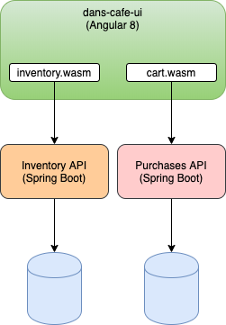

= Dan's Cafe Architecture
1.0.0
:toc: right
:icons: font
:listing-caption: Listing

== Architecture
To satisfy all the requirements we would end up building something like this, but we won't for this tutorial.

.We won't be building this
image::images/Dans Cafe-Architecture.png[]

We are going to slice off the inventory and Purhcases API and work with those only so that we can:

* Display the inventory
** List proudcts
** Select products to see the product definition page
** Add items to the shopping cart
* Populate a shopping cart
** Persist the shopping cart with a TTL of 10 days
** Should work with registered users and 'known' users

.This is what we will build

The Inventory API and Purchases API are already designed, built and ready to run. The focus on this journey is to work out how to create the `inventory.wasm` and `cart.wasm` objects so we can interact with the services.

