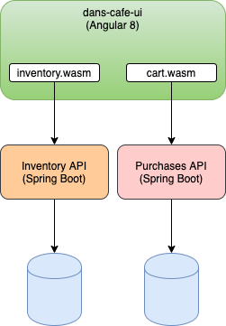

= WebAssembly Tutorial
1.0.0
:toc: right
:icons: font
:listing-caption: Listing

== Introduction
This workshop will be divided into 4 main workshops:

. Creating a module and publishing it to npmjs.org
. Creating an Angular resuable module
. Creating our first WASM (Inventory)
. Integrating our WASM into an Angular8 Application

THe architecture we will be working with is:

We will focus on integrating with the Invenory API and leave the integration with the Purchases API up to you to derive from the work learnt.

== Tools

There are some basic tools we will need for this tutorial:

* https://nodejs.org/en/[Node.js & NPM]
* https://rustup.rs/[RustUp]
* An IDE such as Atom or Visual Studio Code
* A basic knowledge of Rust
* Basic knowledge of Typescript

